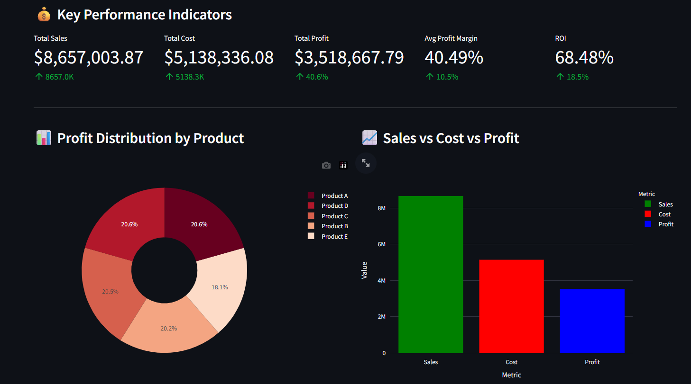
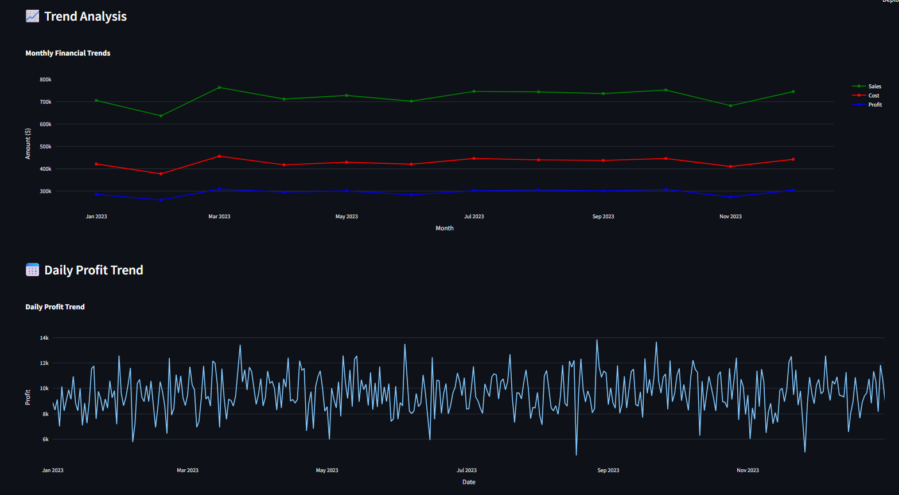
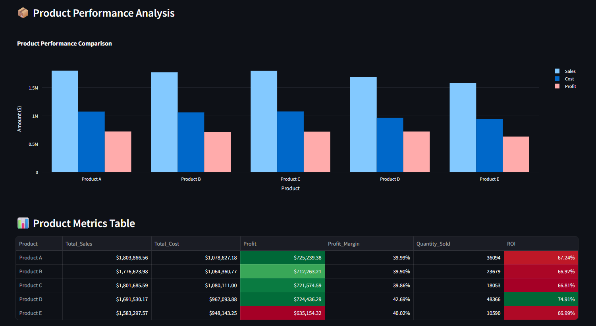

# Profit-Analysis-Dashboard
Interactive company profit analysis dashboard with real-time calculations, trend visualizations, and product performance metrics. Built with Python, Streamlit, and Plotly. Formula: Profit = (Sales × Quantity) - (Cost × Quantity)

📊 Company Profit Analysis Dashboard

A comprehensive, interactive dashboard for analyzing company profitability with real-time calculations and visualizations.

🌐 Live Demo

🔗 **[View Live Dashboard](http://your-app-url.streamlit.app)** *(Coming Soon)*

📊 Overview

This dashboard provides real-time profit analysis using the fundamental business formula:

Profit = (Sales Price × Quantity) - (Cost × Quantity)

✨ Key Features

- 📈 **Real-time Profit Calculations** - Instant computation of profit metrics
- 📊 **Interactive Visualizations** - Dynamic charts using Plotly
- 🎛️ **Smart Filters** - Filter by date range and products
- 📉 **Trend Analysis** - Monthly and daily profit trends
- 📦 **Product Performance** - Detailed product-wise profitability
- 💾 **Data Export** - Download filtered data as CSV
- 📱 **Responsive Design** - Works on all devices

🖼️ Screenshots

### Dashboard Overview

### Trend Analysis

### Product Performance

🚀 Getting Started

### Prerequisites

- Python 3.9 or higher
- pip package manager

### Installation

1. **Clone the repository**
   
   git clone https://github.com/yourusername/profit-analysis-dashboard.git
   cd profit-analysis-dashboard

2. **Install dependencies**

   pip install -r requirements.txt
   
3. **Run the dashboard**

   streamlit run app/profit_dashboard.py

4. **Open your browser**

   Navigate to http://localhost:8501

📈 How It Works
Profit Calculation Formula
The dashboard calculates various profit metrics:

Metric	             Formula	                        Description
Total Sales	Unit Price × Quantity Sold	Total revenue generated
Total Cost	Unit Cost × Quantity Sold	Total cost incurred
Net Profit	Total Sales - Total Cost	Actual profit earned
Profit Margin	(Profit / Sales) × 100	        Profit as % of sales
ROI	        (Profit / Cost) × 100	        Return on investment

**Dashboard Components**

1. Overview Tab

- Key Performance Indicators (KPIs)
- Profit distribution pie chart
- Sales vs Cost vs Profit comparison

2. Trends Tab

- Monthly financial trends
- Daily profit patterns
- Time-series analysis

3. Products Tab

- Product performance comparison
- Individual product ROI
- Detailed metrics table

4. Data Table Tab

- Raw data view
- Export functionality
- Summary statistics

🛠️ **Technology Stack**

Technology	Purpose
Python 3.9+	Core programming language
Streamlit	Web app framework
Pandas	        Data manipulation
Plotly	        Interactive visualizations
NumPy	        Numerical computations

📊 **Sample Data**

The dashboard can work with data in the following format:

Date	        Product	     Unit_Price	  Unit_Cost	Quantity_Sold
2023-01-01	Product A	50.00	    30.00	     100
2023-01-01	Product B	75.00	    45.00	     80

🤝 **Contributing**

Contributions are welcome! Please feel free to submit a Pull Request.

1. Fork the project
2. Create your feature branch (git checkout -b feature/AmazingFeature)
3. Commit your changes (git commit -m 'Add some AmazingFeature')
4. Push to the branch (git push origin feature/AmazingFeature)
5. Open a Pull Request

📝 **License**

This project is licensed under the MIT License - see the LICENSE file for details.

👤 **Author**

Aryan Ranjan

- GitHub: @Aryan11Ranjan
- LinkedIn: www.linkedin.com/in/aryan-ranjan-7ba473270
- Portfolio: coming soon

🙏 **Acknowledgments**

- Streamlit team for the amazing framework
- Plotly for interactive visualization capabilities
- Python community for continuous support

📞 **Support**

For support, email aryan11ranjan@gmail.com or open an issue in the GitHub repository.

 Made with ❤️ using Python and Streamlit 

  

